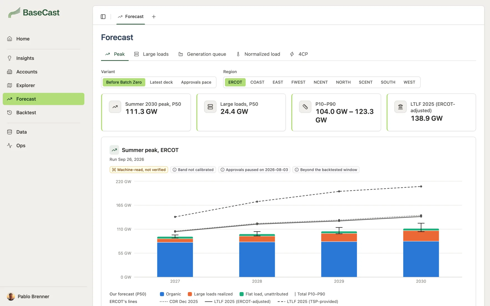
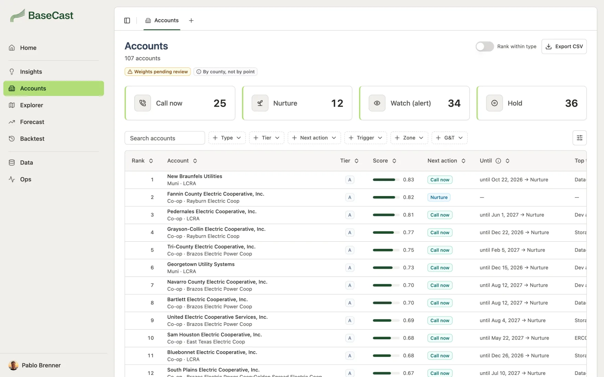
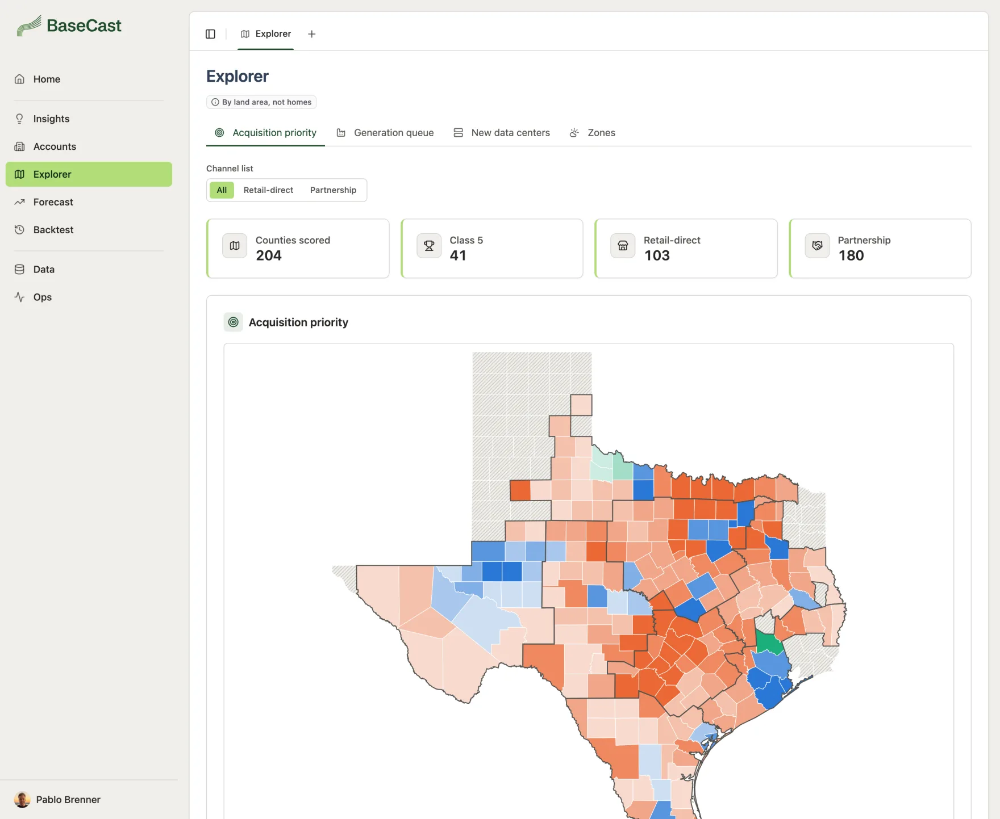
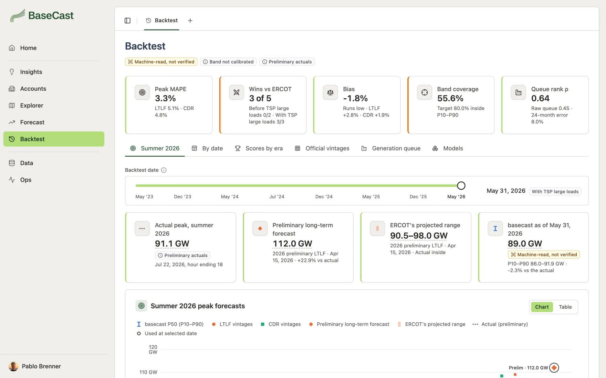

<div align="center">

<picture>
  <source media="(prefers-color-scheme: dark)" srcset="docs/assets/logo-dark.svg">
  
</picture>

**How much of Texas' interconnection queue actually gets built: where, when, and which co-op to call about it.**

[](https://basecast.pbrenner.com)
[](#)
<br>


</div>

<picture>
  <source media="(prefers-color-scheme: dark)" srcset="docs/assets/forecast-dark.webp">
  
</picture>

## Why

<table>
  <tr>
    <td align="center" width="33%"><h2>232.5 GW</h2>large loads in ERCOT's queues, Jan 2026</td>
    <td align="center" width="33%"><h2>3.8%</h2>of them approved to energize</td>
    <td align="center" width="33%"><h2>~21 GW</h2>by which ERCOT's preliminary forecast missed the 2026 peak</td>
  </tr>
</table>

Texas plans its grid around queues that are mostly paper. BaseCast forecasts how much of them gets built,
turns that into a **peak MW forecast by region and year (P10/P50/P90)**, and tells
[Base Power](https://www.basepowercompany.com)'s partnerships team **which co-ops and munis to approach, when,
and with what offer**.

## Screens

<table>
  <tr>
    <td width="50%">
      <picture>
        <source media="(prefers-color-scheme: dark)" srcset="docs/assets/accounts-dark.webp">
        
      </picture>
      <b>Accounts</b>: every co-op and muni ranked, with its next action
    </td>
    <td width="50%">
      <picture>
        <source media="(prefers-color-scheme: dark)" srcset="docs/assets/account-dark.webp">
        
      </picture>
      <b>Account</b>: why now, the score, the territory and the pitch
    </td>
  </tr>
  <tr>
    <td width="50%">
      <picture>
        <source media="(prefers-color-scheme: dark)" srcset="docs/assets/explorer-dark.webp">
        
      </picture>
      <b>Explorer</b>: Texas by county, from acquisition priority to new data centers
    </td>
    <td width="50%">
      <picture>
        <source media="(prefers-color-scheme: dark)" srcset="docs/assets/backtest-dark.webp">
        
      </picture>
      <b>Backtest</b>: our model and every ERCOT vintage against the actual peak
    </td>
  </tr>
</table>

Visitors land on the product page at `/`, with the engineering overview at `/how-its-built` one toggle away
(static pages in `public/landing/`). Signed in, `/` opens **Insights** (the headline findings re-derived from
the data). Also: **Data** (every raw
file, table and pipeline run, with the dataset lineage) and **Ops** (service health, requests and logs).

## How it fits

```mermaid
flowchart TB
  src["Public data: ERCOT · PUCT · EIA · Census · BLS · NOAA · TCEQ · …"]

  subgraph airflow["basecast-airflow"]
    direction LR
    raw["raw<br/>immutable snapshots"] --> process["process<br/>typed tables"] --> marts["marts<br/>models + golden checks"]
  end

  subgraph getdata["basecast-get-data"]
    direction LR
    api["FastAPI<br/>one typed endpoint per resource"] --> meta["{data, meta}<br/>provenance + caveats"]
  end

  subgraph app["basecast-app · this repo"]
    direction LR
    bff["BFF route handlers<br/>token stays on the server"] --> ui["Next.js screens<br/>on Vercel"]
  end

  src --> airflow
  airflow -- "Postgres · GCS · BigQuery" --> getdata
  getdata -- "openapi.json → TS client" --> app

  style app fill:#b2dd79,stroke:#102a17,stroke-width:2px,color:#102a17
```



The browser only talks to this app's route handlers; they call get-data with a server-side token, through the
TypeScript client generated from its OpenAPI spec. Every card shows the API's caveats, and the screen's
provenance sits at its foot.

## Quickstart

```bash
npm install
cp .env.example .env.local   # GET_DATA_URL, GET_DATA_TOKEN (server-only), DATABASE_URL, NEXTAUTH_SECRET
npm run dev                  # http://localhost:3000
```

Every app page needs a sign-in, so a local run needs the Cloud SQL proxy and a running
[basecast-get-data](https://github.com/brennerpablo/basecast-get-data). See [docs/operations.md](docs/operations.md).

<details>
<summary><b>Scripts</b></summary>

| Script | What it does |
|---|---|
| `npm run dev` | Dev server (Turbopack) |
| `npm run build` | Production build |
| `npm run lint` · `npm run typecheck` | ESLint · TypeScript, no emit |
| `npm test` | Unit and DOM tests (`node:test` via `tsx`) |
| `npm run api:generate` | Regenerates `src/lib/api/get-data.d.ts` from `../basecast-get-data/openapi.json` |
| `npm run db:push` | Applies `prisma/schema.prisma` to the database |
| `npm run user:create` | Creates a password user |
| `npm run email:test` | Sends a sample email |

Node 22 or newer (`.nvmrc` pins 24, the version on Vercel). A push to `main` deploys to production.

</details>

## Docs

- [docs/operations.md](docs/operations.md): access, the `/data` browser, the ops log, email, deploy
- [docs/decisions.md](docs/decisions.md): decision log
- [docs/KICKOFF.md](docs/KICKOFF.md): project kickoff (Portuguese)

<div align="center">
<sub>
<a href="https://github.com/brennerpablo/basecast-airflow">basecast-airflow</a> ·
<a href="https://github.com/brennerpablo/basecast-get-data">basecast-get-data</a> ·
<b>basecast-app</b>
</sub>
</div>
